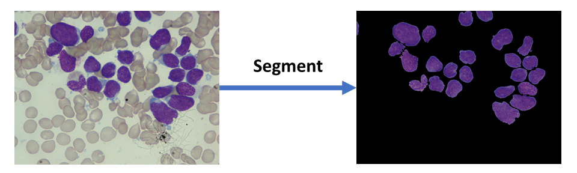

## Overlapping Cell Nuclei Segmentation in Microscopic Images Using Deep Belief Networks

Automatic medical image analysis, specifically automatic diagnosis through medical imaging is an active research area. Such diagnosis requires one to operate on individual cells. This opens up the problem of accurate cell segmentation. The current repository implements a method for segmenting White Blood Cells stained with the Jenner-Geimsa Stain. For details regarding the approach please refer to our [paper](http://dl.acm.org/citation.cfm?id=3010043).

### Citing this code

If you find this code useful in your research, please consider citing:

    @inproceedings{duggal2016overlapping,
    title={Overlapping cell nuclei segmentation in microscopic images using deep belief networks},
    author={Duggal, Rahul and Gupta, Anubha and Gupta, Ritu and Wadhwa, Manya and Ahuja, Chirag},
    booktitle={Proceedings of the Tenth Indian Conference on Computer Vision, Graphics and Image Processing},
    pages={82},
    year={2016},
    organization={ACM}
    }

### Contents
1. [Acknowledgements](#acknowledgements)
2. [Disclaimer](#disclaimer)
3. [Training](#training)
4. [Demo](#demo)
5. [Stain-Vector-Correction](#stain-vector-correction)
6. [References](#references)
7. [Contact](#contact)
8. [License](#license)

## Acknowledgements
We would like to thank the authors of the softwares - [DeepLearnToolbox](https://github.com/rasmusbergpalm/DeepLearnToolbox) [2] and [Stain Normalization Toolbox](http://www2.warwick.ac.uk/fac/sci/dcs/research/tia/software/sntoolbox/), which we use in this work.

## Disclaimer
In our original work [3], we used an in-house stain normalization approach which is yet to be published. For demonstration purposes, this code uses another standard normalization approach by Macenko et al [1] as implemented in the Stain normalization toolbox. Since this implementation is optimized for H&E stained images, whereas we adapt it for a different tissue and stain type, reproducibility of results quoted in our paper is not guaranteed.

#### Caution : 
The stain normalization method by Macenko et al [1] and implemented by the stain normalization toolbox is prone to suffer from stain vector flipping. In such cases you need to perform manual stain vector correction. This correction is outlined in the [Stain-Color-Correction](#Stain-Vector-Correction) section. **Always display the stain normalized image to see if the normalization is performed correctly**!!!

## Training

The code used for creating the training dataset resides in the `Train` subdirectory. The specific file which creates the dataset is `Train/createData.m`. This code requires three preliminary steps to be performed which are outlined below.

1. Place training images in `Data/Raw_Images`.
2. Run the file `Utils/utils.m`. This extracts clusters and places them in `Data/Training_Images_Macenko`.
3. Copy these images into `Data/Training_Images_Macenko_Labelled` and mark the pixels belonging regions of interest with the pencil tool of microsoft paint. The colour must be set to (255,255,255).
4. Run `Train/createData.m` to create dataset.
5. Run `Train/train.m` to train a Deep Beleif Network

Please read the word of caution provided in the Disclaimer section. The normalized training images are written to `Data/Normalized_Raw_Images`.

The corresponding folders within `Data/` contain some sample images which serve as illustrative examples. Once the above steps have been performed, run the file `Train/createData.m`. This creates the dataset in the matlab workspace.

We have performed the above steps to create a sample dataset which can be readily fed into a classifier. 

This dataset can be downloaded from [here](https://www.dropbox.com/sh/lja8zkgxyps3p88/AACipzXVowYs8bH6y0i4VExUa?dl=0).

## Demo

A pre-trained Deep Belief Network model can be downloaded from [here](https://www.dropbox.com/sh/uj9yk2e6xloq8zv/AACrL8_verKHu3ceKkReAx97a?dl=0).

This model has been trained on 0.3 million pixels sampled from 27 images. For a small demo, perform the following steps :-

1. Run the `Stain_Normalization_Toolbox/install.m` file to install the normalization toolbox.
2. download the pre-trained model and save it in the `Models` subdirectory.
3. Run `demo.m`.

Since the test image is of high resolution [2560x1920], the code requires atleast 16 GB of combined RAM + SWAP memory. In case you don't have the necessary hardware, consider resizing the input image by a factor of 2. However this greatly deteriorates the performance of the method.

## Stain-Vector-Correction
In case the normalization is drastically incorrect, the problem is due to stain vector flipping. To correct for this, we need to manually align the stain vector of reference and query images. This is done through the following steps.

1. Uncomment lines 98-100 in `Stain_Normalization_Toolbox/StainNormalization/NormMacenko.m`.
2. Run the code to see what the current order of stain vectors is, for the reference and query images. Note down the intended new order. For example if the first and second vectors need to be flipped, then the intended new order should be [2,1,3].
3. Change line 99, to reflect the intended new order of stain vectors. 

## References

[1] Macenko, Marc, et al. "A method for normalizing histology slides for quantitative analysis." Biomedical Imaging: From Nano to Macro, 2009. ISBI'09. IEEE International Symposium on. IEEE, 2009.

[2] Palm, Rasmus Berg. "Prediction as a candidate for learning deep hierarchical models of data." Technical University of Denmark 5 (2012).

[3] Duggal, Rahul, et al. "Overlapping cell nuclei segmentation in microscopic images using deep belief networks." Proceedings of the Tenth Indian Conference on Computer Vision, Graphics and Image Processing. ACM, 2016.

## Contact

For any assistance with the code or for reporting errors, please get in touch at rahulduggal2608 [at] gmail [dot] com.

## License
This code is released under the MIT License (refer to the LICENSE file for details).
